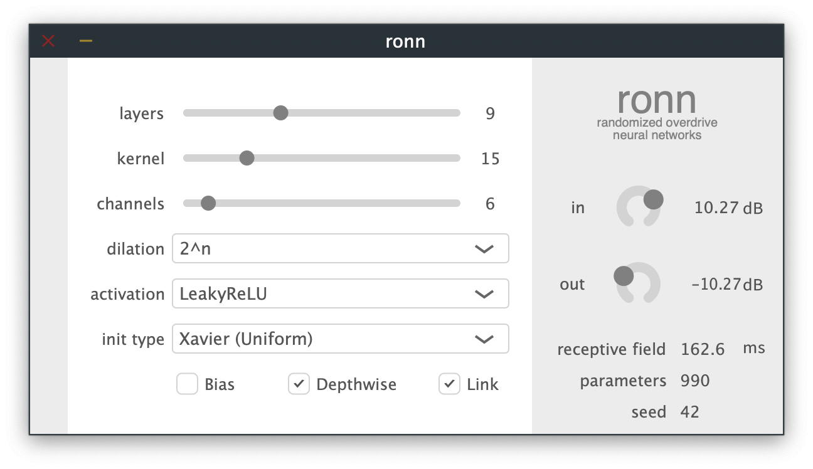
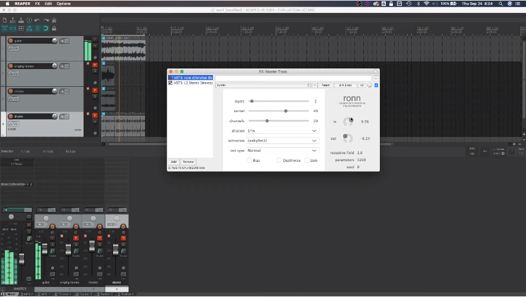

<div  align="center">


# ronn
Randomized Overdrive Neural Networks

[](https://opensource.org/licenses/Apache-2.0)
[](https://arxiv.org/abs/2010.04237)


</div>

## What is ronn?
Throughout audio technology history, engineers, circuit designers, and guitarists have searched tirelessly for 
novel, extreme, and exciting effects as a result of clipping audio signals. Whether it be vacuum tubes (valves), 
diodes, transistors, op-amps, microchips, or broken speaker drivers doing the distorting, it seems that we have tried them all. 
But maybe there is at least one area left relatively under-explored, and thats the realm of *neural networks*. 

Now neural networks, have been a round for a bit. They have actually
ALREADY been used to model distortion and overdrive effects from guitar amplifier and pedals quite a bit 
(such as 
[here](https://ieeexplore.ieee.org/document/6567472), 
[here](https://www.mdpi.com/2076-3417/10/3/766/htm), 
[here](https://ieeexplore.ieee.org/abstract/document/8683529), 
and [here](https://teddykoker.com/2020/05/deep-learning-for-guitar-effect-emulation/)). 
So then you may be asking, "well how is this any different?"
And the answer is, **ronn** doesn't model ANY pre-existing audio circuit, **we don't even bother to train anything!** 
Instead we treat the concept of the neural network as a system which can distort a signal, and then we give the user 
control over that system to explore new effects. Get your hands dirty building neural networks without even
touching TensorFlow or PyTorch. 

<div  align="center">
<p>Click the thumbnail below to watch a live demo of the plugin.</p>
<a href="https://youtu.be/s1p_CvwDEB8" target="blank_"></a> 
</div>

## Setup

### Download
We supply pre-built VST/AU plugins [here](https://drive.google.com/file/d/15tA3X21N5FhLsDvElGBArUFA9cTogDLL/view?usp=sharing).

Once downloaded, unzip and move to:
```
AU: Macintosh HD/Library/Audio/Plug-Ins/Components
VST3: Macintosh HD/Library/Audio/Plug-Ins/VST3
```

Currently, we only have macOS builds. 

### Build
You can also build from source.

This will require that you have JUCE v5 installed.
Then you need to install [libtorch](https://pytorch.org/cppdocs/) (PyTorch C++ API).

1. Download the `.zip` file containing the source.
```
wget https://download.pytorch.org/libtorch/nightly/cpu/libtorch-shared-with-deps-latest.zip
unzip libtorch-shared-with-deps-latest.zip
```    
2. Unzip this and place the `libtorch` directory into the `plugin` directory. 
3. Change to the root of the plugin project.
```
cd plugin/juce/ronn
```
4. Run the `build.sh` script, which will build the plugin. 

## Details

The **ronn** plugin enables users to run their audio directly through randomly weighted [temporal convolutional networks](https://arxiv.org/abs/1803.01271) (TCNs).
Interestingly, using networks that have not been trained can produce a wide range of compelling audio effects
simply by adjusting the architectural elements. 
These effects range from subtle distortion and overdrive, to more extreme drone-like and glitch effects. 


### Features

- Construct different neural networks and listen to the results in real-time.
- Adjust architectural elements:
  - Depth of the network
  - Convolutional kernel size
  - Width of the convolutional layers
  - Dilation growth factor
  - Activation functions
  - Weight initialization scheme
- Global seed control enables presets and recallability.
- Link the input/output gain to control overall drive level.
- Use depthwise convolutions for less CPU impact.
- Inspect the receptive field of the network and number of parameters.

## More to come in the future...
- a GUI that shows the construction of the network as you add layers, change activations, etc. 
- a transfer function window that shows the shape of the current activation function being used. 
- use FiLM as a further way to adjust the distortion character. For example, create a 2D plane the
  user will sample from and then use a set of linear layers to project this to gamma and beta coefficients
  for each layers (using linear adaptors), then the user can control the input to this MLP. 
- What if you randomized the weights in each layer every time you accessed that layer?

## Citation
```
@article{steinmetz2020overdrive,
        title={Randomized Overdrive Neural Networks},
        author={Steinmetz, Christian J. and Reiss, Joshua D.},
        journal={arXiv preprint arXiv:2010.04237},
        year={2020}}
```