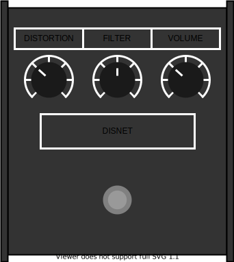

The sweet sound of that neural network distortion

## What is DISNET?
Throughout audio technology history, engineers, circuit designers, and guitarists have searched tirelessly for 
novel, extreme, and exciting effects as a result of clipping audio signals. Whether it be vacuum tubes (valves), 
diodes, transistors, op-amps, microchips, or broken speaker drivers doing the distorting, it seems that we have tried them all. 
But maybe there is at least one area left relatively under-explored, and thats the realm of *neural networks*. 

Now neural networks (simply a series of matrix operations), have been a round for a [bit](). They have actually
ALREADY been used to model distortion effects from guitar amplifier and pedals quite a bit 
(such as [here](), [here](), [here](), and [here]()). So then you may be asking, "well how is this any different?"
And the answer is, **DISNET** doesn't model ANY pre-existing audio circuit, we don't even bother to train anything! 
Instead we treat the concept of the neural network as a system which can distort a signal, and then we give the user 
control over that system to explore new effects. Get your hands dirty building neural networks without even
touching TensorFlow or PyTorch. 

## Features

### Convolutional Network
- Number of layers
- Kernel size 
- Stride
- Activation functions (ReLU, Tanh, PReLU)
- Dilation pattern
- Initialization method 
- Randomize all weights